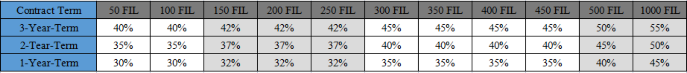

### Target: 
All customers that accept digital-asset mining investment, including investors and referrers. Currently, we are promoting Filecoin real-data storage mining.

### Characteristics: 
It turns the complex digital-asset mining investment into a simple, stable and reliable investment for every investors. For example, It turns the Filecoin real-data storage mining service into a simple pledging incentive mechanism, which will offer investors 80% daily mining yield providing no risk of losing the principal.

### Investment orientation: 
TenetDS and 1475 Team will be responsible for the investment management. All FIL pledged by users will be used in Filecoin real-data storage mining. The 20% mining yield will be used to cover the cost of hardware, software, server room, Datacap investment in Filecoin mining, while 80% mining yield will be allocated to investors.

### Product Details
> (1)Based on the number of pledged FIL, each investor can receive 30 - 55% daily mining yield. The remained will be distributed to referrers as promotion fee. (To receive promotion fee, the referrer must have signed the 3-year mining contract.)
> 
> (2)FIL pledge number and earning rate:
> 
> 
> 
> (3)Contract term: Investors can choose to sign a 1-year/2-year/3-year term contract, and it can extend for 2 years if the 3-year-term contract expires.
> 
> (4)Contract termination: Referrers who want to receive the promotion fee must sign a 3-year-term contract. The investors signing for 1-year/2-year term contract can only receive the daily mining yield. Investors can terminate the contract before the 1-year-term contract expires, but all yield will be took back and only the principal returned to investors.
> 
> (5)The earning will start to be calculated 7 days after pledging FIL coin.
> 
> (6)Earning distribution: it will be distributed to customers every Tuesday.