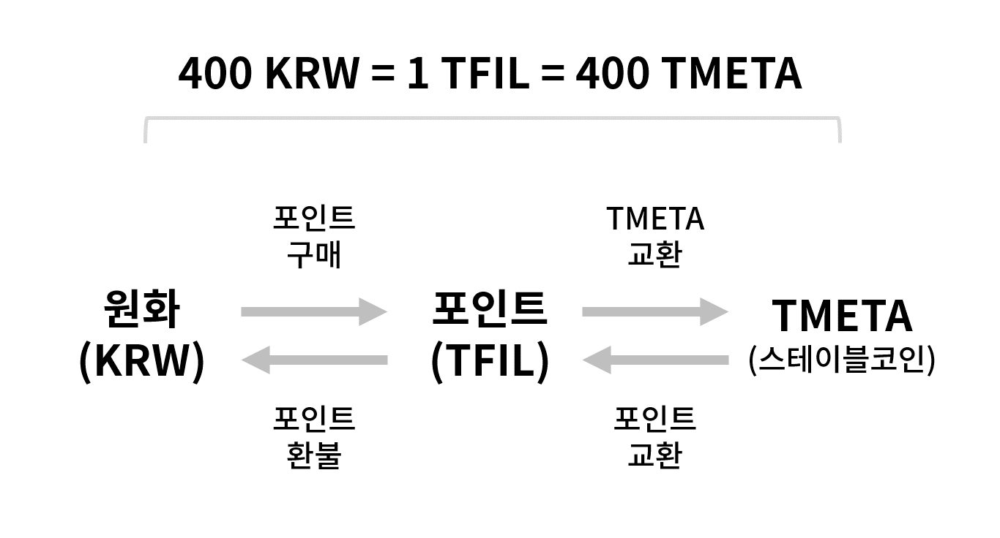

[//]: # (积分&稳定币介绍)

[TFIL 소개]

TFIL은 '티보너스 프로'에서 사용되는 포인트의 단위입니다. 앱에서 KRW로 구매(충전)와 환불을 할 수 있으며 1 TFIL은 400 KRW입니다. TFIL은 티보너스 프로에서 다음 두가지로 활용됩니다.

1. 타 거래소에서 가상자산 거래에 필요한 KRW 충전/환불을 쉽게 할 수 있습니다.

KRW로 구매하신 TFIL은, 스테이블 코인인 'TMETA'와 서로 교환할 수 있습니다. 1 TFIL은 400 TMETA입니다.

TMETA 마켓이 있는 거래소로 TMETA를 이체하면, 해당 마켓에서 다른 가상자산과 거래하실 수 있습니다. 거래 후 TMETA를 다시 '티보너스 프로'로 이체하시면, TMETA를 TFIL로 교환하실 수 있으며 KRW로 TFIL 환불도 가능합니다.

현재 TMETA 마켓은 가상자산 거래소, 토큰캔에 오픈되어 있으며, 해당 마켓에서 비트코인(BTC), 이더리움(ETH), 파일코인(FIL)을 거래하실 수 있습니다.

[//]: # (토큰캔 안드로이드 앱 설치하기 >)

2.  '티보너스 프로'의 여러 재테크 상품에 가입할 수 있습니다.

현재 오픈된 포인트(TFIL) 예치상품, 'T보너스'의 경우 파일코인(FIL) 마이닝에 필요한 Miner 서버를 대여하는 상품권 역할을 합니다. 자세한 내용 아래 'T보너스 상품소개'에서 확인 부탁드립니다.

[T보너스 상품소개 >](https://tbonuspro.imweb.me/service/?q=YToxOntzOjEyOiJrZXl3b3JkX3R5cGUiO3M6MzoiYWxsIjt9&bmode=view&idx=10367714&t=board)

[TMETA 소개]

TMETA는 메타버스를 위한 스테이블 코인입니다.

최근 온라인 가상공간과 현실의 융합 공간인 메타버스(Metaverse)가 우리의 삶에 서서히 스며들고 있습니다. 메타버스는 하나의 사회이므로 자체적인 경제 시스템과 금융 시스템을 갖추고 있습니다. NFT와 토큰이 가장 적합한 예입니다.

메타버스 내에서 사람들은 자산을 늘려 더 큰 부가가치를 얻기 위해 노력합니다. 이 자산관리 과정에는 신속한 이체, 교환, 리스크 헤지 등이 필요합니다. 그리고 이를 위해서는 가치의 변동이 크지 않은 ‘안정적인 수단’이 필수적입니다. 바로 이러한 이유로 가치가 일정한 스테이블 코인, TMETA가 탄생하게 되었습니다.

메타버스가 아닌 실제 세계의 자산 가치와 연동된 TMETA는 실제 세계와 메타버스를 연결하는 교두보 역할을 하게 됩니다. TMETA는 향후 수많은 메타버스 플랫폼 내에서 기축이 되는 가상자산으로 자리잡을 예정입니다.

