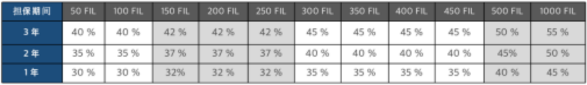

1.ユーザー層：ブロックチェーンマイニング投資を受ける普通の顧客向け、投資顧客及び広告する顧客を含む。現在はFilecoinリアルデータストレージマイニングをメインとする。

2.特徴: 複雑なブロックチェーンマイニング投資を、誰もが参加できるシンプル、安定、信頼できる投資に変えた。例えば、専門のマイニング管理機構を通じ、複雑なFilecoinリアルデータストレージサービスを、簡単な質押ボーナスに変え、顧客の元金が損なわずに、毎日のマイニング収益の80%を投資顧客及び広告する顧客に分配される。

3.投資方向：TenetDS、1475などの資本管理機構が投資管理を担当する。ユーザーが質押したFillはすべてFilecoinリアルデータストレージサービスに使用され、マイニング収益の20%をリアルデータストレージのために必要なハードウェア、ソフトウェア、機械室、Datacapをカバーするために使用される。80%はお客様の割り当てに使用される。

4.製品細則

（1）質押のFil数によって、投資家1人当たり毎日収益の30~55%を得ることができ、残りの毎日収益は広告収益として広告する顧客に分配される。(広告収益を受け取るためには3年間のマイニング宝サービスを契約しなければならない。)

（2）固定の質押数量と収益の比較図：

（3）契約期間：マイニング宝契約選択可能期間：1年/2年/3年、3年の契約終了後、自然に2年継続可能（計5年）

（4）契約解除: 広告収益は3年間契約を申請した会員のみが参加できる。1年/2年の契約会員は毎日のマイニング収益しか得られない。契約解除は1年間契約が満了する前に申請できるが、収益は分配されず、元金のみが返還される。

（5）投資後7日後から収益計算を開始する

（6）収益分配：週2回顧客に支給する