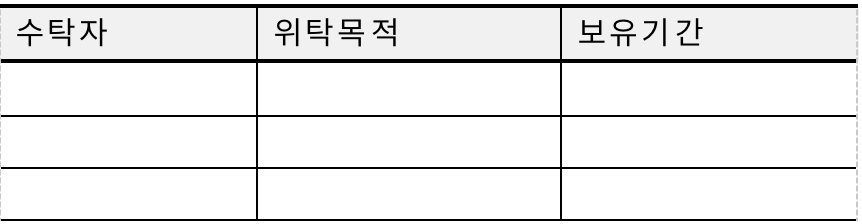
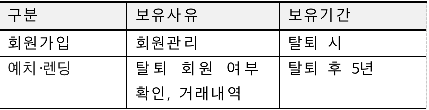
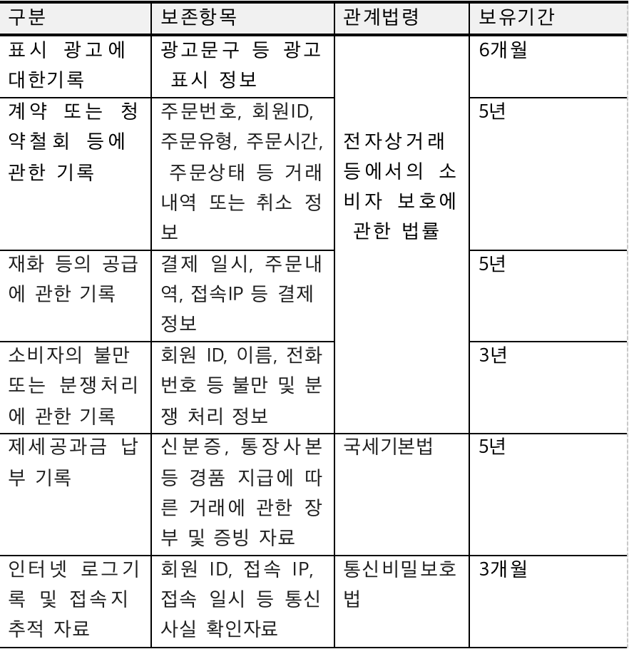

[티라크 개인정보 처리방침]

주식회사 GW TECHNOLOGY(이하 "회사"라 함)는 회원의 개인정보를 중요시하며, ‘정보통신망 이용촉진 및 정보보호 등에 관한 법률’, ‘전자상거래 등에서의 소비자보호에 관한 법률’, ‘통신비밀보호법’, ‘전기통신사업법’, ‘개인정보보호법’ 등에 관한 법률 및 행정기관의 행정지침을 준수하고, 관련 법령에 의거한 개인정보처리방침을 정하여 이용자 권익을 보호하고 있습니다. “회사”의 개인정보처리방침은 개인정보보호와 관련한 법률 또는 지침의 변경, 당사 정책의 변화에 따라 변경될 수 있으므로, 회원께서는 당사 사이트 방문 시 수시로 확인하여 주시기 바랍니다. "회사"의 개인정보처리방침은 다음과 같은 내용을 담고 있습니다.

1. 수집하는 개인정보의 항목 및 수집 방법

   수집하는 개인정보의 항목

   ① “회사”는 이용자의 기본적 인권 침해의 우려가 있는 민감한 개인정보(인종 및 민족, 사상 및 신조, 출신지 및 본적지, 정치적 성향 및 범죄기록, 건강상태 및 성생활 등)는 수집하지 않습니다.

   ② “회사”는 다음과 같이 필수적인 개인정보만을 수집하여 이용합니다.

   1)본인확인 및 회원가입 의사 확인

   – [필수]성명, 휴대폰번호, 통신사, 중복가입확인정보(DI), 이메일 주소

   [선택] 마케팅/이벤트 정보수신

2) 결제 및 출금을 위한 본인인증

- 성명, 생년월일, 성별, 통신사, 휴대폰번호, 연계정보(CI)

3) 비밀번호 초기화

- 이메일 주소

4) 불량회원의 부정 이용 방지와 비인가 사용방지

   - 이용자 접속IP주소, 방문일시, 모바일 기기정보

5) CS 민원 처리시, 신분증 본인인증

   – 신분증(운전면허증 또는 외국인등록증) 사본(이름, 생년월일, 주민번호, 운전 면허번호, 또는 외국인 번호, 유효기간 또는 인증번호, 신분증 사진 등을 제공받음), 본인 확인을 위한 통화 녹취, 셀피로 촬영된 본인 얼굴, 본인 확인을 위한 셀프 동영상 촬영 시 본인 얼굴, 음성 관련 정보

一.개인정보 수집방법

“회사”는 다음과 같은 방법으로 개인정보를 수집합니다.

- 홈페이지, 휴대폰 어플리케이션, 휴대폰 웹페이지, 팩스, 전화, 상담 게시판, 이메일, 이벤트 응모

- 생성정보 수집 툴을 통한 수집 “회사”는 적법하고 공정한 방법으로 서비스 이용계약의 성립 및 이행에 필요한 최소한의 개인정보를 수집하며, 이용자 개인식별이 가능한 정보를 수집하기 전에 개인정보 수집, 이용 동의에 대한 내용을 제공하고, 동의를 받습니다.

3. 개인정보의 수집 및 이용목적
   “회사”는 회원의 개인정보를 수집 이용하는 목적은 다음과 같습니다.

一.회원관리
- 회원제 서비스 이용에 따른 본인확인, 개인식별
- 불량회원의 부정이용 방지와 비인가 사용 방지
- 가입의사 확인
- 미성년자의 확인
- 회원상담, 회원불만 접수 및 처리, 분쟁조정을 위한 기록보존
- 고지사항 전달

나. 서비스 제공에 관한 계약의 이행 및 요금정산
- 서비스 제공, 콘텐츠 제공, 맞춤 서비스 제공
- 요금 결제 및 정산
- 이벤트/경품당첨 결과안내 및 상품배송
  다. 마케팅 및 광고에 활용
- 회원에게 최적화된 서비스 제공
- 신규 서비스(제품) 개발 및 특화
- 인구통계학적 특성에 따른 서비스 제공 및 광고 게재
- 웹페이지 접속 빈도 파악
- 서비스 이용에 대한 통계
- 정기 간행물 발송, 신규 상품 또는 서비스 안내
- 회원 관심사에 부합하는 웹서비스 및 이벤트 기획
- 경품행사, 이벤트, 회사소식 등 관계사/제휴사 소식 등 광고성 정보 또는 회원 참여공간 운영
- 회원설문조사

3. 개인정보의 제공
   “회사”는 회원의 개인정보를, 수집 시 회원에게 고지한 범위 또는 서비스 이용약관에 명시한 범위를 넘어 이용하거나 제3자에게 제공하지 않습니다. 다만, 회원의 동의가 있거나 다음에 해당하는 경우에는 예외로 합니다.

가. 제휴관계: 보다 나은 서비스 제공을 위하여 회원의 개인정보를 제휴사에게 제공하거나 또는 제휴사와 공유할 수 있습니다. 개인정보를 제공하거나 공유할 경우에는 사전에 회원께 제휴사 법인명, 제공 또는 공유되는 개인정보항목 종류, 개인정보가 제공 혹은 공유되는 이유, 언제까지 어떻게 보호 • 관리되는지에 대해 개별적으로 서면 또는 전자우편 등을 통해 고지하여 동의를 구하는 절차를 거치게 되며, 회원께서 동의하지 않는 경우 제휴사에게 제공하거나 제휴사와 공유하지 않습니다. 제휴관계에 변화가 있거나 제휴관계가 종결될 때도 같은 절차에 의하여 고지하거나 동의를 구합니다.

나. 매각•인수합병 등: 영업의 전부 또는 일부를 양도하거나, 합병•상속 등으로 서비스제공자의 권리•의무를 이전 승계하는 경우 개인정보보호 관련 회원의 권리를 보장하기 위하여 반드시 그 사실을 회원에게 통지합니다.

다. 서비스의 제공에 관한 계약의 이행을 위하여 필요한 개인정보로서 경제적•기술적인 사유로 통상의 동의를 받는 것이 현저히 곤란한 경우

라. 서비스 제공에 따른 요금정산을 위하여 필요한 경우

마. 통신비밀보호법, 국세기본법, 정보통신망 이용촉진 및 정보보호 등에 관한 법률, 금융실명거래 및 비밀보장에 관한 법률, 신용정보의 이용 및 보호에 관한 법률, 전기통신기본법, 전기통신사업법, 지방세법, 소비자기본법, 한국은행법, 형사소송법 등 다른 법률에 특별한 규정이 있는 경우. 단, 법률에 특별한 규정이 있는 경우’로 행정목적이나 수사목적으로 행정관청 또는 수사기관이 요구해 온 경우라도 무조건 회원의 개인정보를 제공하지 않으며, 법률에 규정된 바에 따라 영장 또는 기관장의 직인이 날인된 서면에 의한 경우 등 적법한 절차에 따라 제공합니다.

바. 자사 서비스를 이용하여 타인에게 정신적, 물리적 피해를 줌으로써 그에 대한 법적인 조치를 취하기 위하여 개인정보를 공개해야 한다고 판단되는 충분한 근거가 있는 경우

사. 자사 상품은 유멍+SDK를 집적했으며, 유멍 + SDK는 회원의 Mac 주소, 유일 디바이스 식별부호(IMEI/android ID/IDFA/OPENUDID/IP주소/GUID, SIM카드, IMSI정보) 통계 분석 서비스에 제공합니다. 또한 지리적 위치를 통해 리포트 정확성을 확인하며 기초적인 안티 스팸 능력을 제공합니다.

4. 개인정보의 처리 위탁

   “회사”는 원활하고 향상된 서비스를 위하여 개인정보를 제한된 범위에서 타 업체에게 위탁하여 관리할 수 있습니다. 현재 회원과의 서비스 계약 이행을 위해 당사가 개인정보처리를 위탁하는 업체는 아래와 같으며, 관계법령에 따라 위탁 계약시 개인정보가 안전하게 관리될 수 있도록 필요한 사항을 규정하고 있습니다.

• 개인정보처리위탁 업체

“회사”는 위탁업무의 내용이나 수탁자가 추가 및 변경될 경우에는 지체없이 본 개인정보처리방침을 통하여 공개하고 이용자의 동의가 필요한 경우 이용자들의 동의를 받습니다.

5. 개인정보의 보유 및 이용기간

> 가. “회사”는 관계법령에 따른 개인정보 보유 및 이용기간 또는 회원의 개인정보 수집 시에 동의 받은 개인정보 보유 및 이용기간에 따라 개인정보를 처리하고 있습니다.
>
> 나. “회사”는 아래와 같이 필요한 경우에만 개인정보를 보유 및 이용합니다.

① 예치·렌딩 서비스를 위한 개인정보 보유 및 이용기간

② 재화 또는 서비스 제공에 따른 법령에 의한 보존

6. 개인정보 파기 절차 및 방법

   “회사”는 수집한 개인정보의 이용목적이 달성된 후에는 보관기간 및 이용기간에 따라 해당 정보를 지체없이 파기 또는 별도 분리 보관합니다. 단, 회원께서 회원탈퇴 시 모든 개인정보는 자동 파기됩니다. 그 절차, 시점, 방법은 다음과 같습니다.

가. 파기절차 및 시점

- 회원이 서비스 가입 등을 위해 기재한 개인정보는 서비스 해지 등 이용목적이 달성된 후 내부 방침 및 기타 관련 법령에 의한 정보보호 사유(위 개인정보의 보유 및 이용기간 참조)에 따른 보유기간이 경과한 후에 즉시 파기합니다. 일반적으로 잔존하는 채권-채무 관계가 없는 경우 “회사” 회원가입시 수집되어 전자적 파일형태로 관리하는 개인정보는 회원 탈퇴 시점에 바로 삭제됩니다.

나. 파기방법

- 종이에 출력된 개인정보는 분쇄기로 분쇄 또는 소각하거나 화학약품 처리를 하여 용해하여 파기하고, 전자적 파일형태로 저장된 개인정보는 기록을 재생할 수 없는 기술적 방법을 사용하여 삭제합니다.

다. 분리 보관 시점 및 방법

- ‘개인정보 유효기간제’에 따라 1년간 서비스를 이용하지 않은 경우, 해당 이용자의 계정은 휴면상태로 전환됩니다. 휴면상태 회원의 개인정보는 별도 분리하여 보관되며, 접근 제한 및 보안적용하여 관리됩니다.

8. 이용자 및 법정 대리인의 권리와 그 행사방법

   가. 이용자 및 법정 대리인은 언제든지 등록되어 있는 자신의 개인정보에 대해 다음의 권리를 행사할 수 있습니다.

   개인정보 열람요구

   개인정보 오류 등이 있을 경우 정정요구

   개인정보 삭제 요구

   개인정보 처리정지 요구

나. 이용자 및 법정 대리인은 “회사” 홈페이지에 로그인 후 ‘회원정보변경’에서 개인정보를 열람 또는 정정하시거나, ‘회사’의 개인정보 보호책임자에게 전자우편 또는 서면 요청을 통해 정정이 가능합니다.

다. 이용자 및 법정 대리인의 ‘개인정보 수집 및 이용에 대한 동의’ 철회(해지)는 이메일, 전화, 팩스를 통해 가능합니다.

라. 이용자 및 법정 대리인이 개인정보의 오류에 대한 정정 및 삭제를 요청한 경우에는 처리 완료시까지 당해 개인정보를 이용 또는 제공하지 않습니다. 또한 “회사”는 이용자 혹은 법정 대리인의 요청에 의해 해지 또는 삭제된 개인정보는 "개인정보의 보유 및 이용기간"에 명시된 바에 따라 처리하고 그 외의 용도로 열람 또는 이용할 수 없도록 처리하고 있습니다.

8. 개인정보의 안전성 확보 조치

   “회사”는 개인정보의 안정성 확보를 위해 다음과 같은 조치를 취하고 있습니다.

   가. 관리적 보호조치

   ① 내부관리계획의 수립 시행
- 개인정보보호책임자의 지정에 관한 사항

- 개인정보보호책임자 및 개인정보취급자의 역할 및 책임에 관한 사항

- 개인정보의 안전성 확보에 필요한 조치에 관한 사항

- 개인정보취급자 및 위탁업체에 대한 교육에 관한 사항

- 그 밖에 개인정보 보호를 위하여 필요한 사항

  ② 정기적인 자체 감사 실시

- 개인정보 보호책임자와 감사자의 직무분리 사항

- 개인정보 감사자의 역할 및 책임에 관한 사항

- 개인정보 취급 관련 안전성 확보를 위한 정기적 자체 감사

나. 기술적 보호조치

① 개인정보취급자의 회원정보의 유출을 방지하기 위하여, 개인정보 유출방지 시스템을 운영하고 있으며, 단말기(PC) 및 네트워크 상의 전송되는 개인정보는 안전한 암호 알고리즘을 적용하고 있습니다.

② 개인정보처리시스템에 대한 접근권한을 업무 수행에 필요한 최소한의 범위로 하여, 업무 담당자 별로 한 개의 사용자 계정을 차등 부여하고 있으며, 개인정보취급자가 변경되었을 경우 개인정보시스템의 접근권한을 변경 또는 말소하고 그 기록을 최소 5년간 보관합니다. 또한, 개인정보취급자의 비밀번호 작성규칙을 수립하여 적용하고 있습니다.

③ 개인의 고유식별정보, 비밀번호를 정보통신망을 통하여 송•수신하거나 보조저장매체 등을 통하여 전달하는 경우에는 이를 상용 암호화 소프트웨어를 사용하여 저장하고 있으며, 비밀번호는 안전한 암호알고리즘으로 암호화하여 저장합니다.

④ 개인정보취급자가 개인정보처리시스템에 접속한 기록을 최소 2년 이상 보관•관리하며, 개인정보취급자의 접속기록이 위•변조 및 도난, 분실되지 않도록 해당 접속기록을 안전하게 보관하고 있습니다.

⑤ 개인정보처리시스템 또는 업무용 컴퓨터에 악성 프로그램 등을 방지•치료 할 수 있는 백신 소프트웨어 등의 보안 프로그램을 설치•운영하고 있으며, 보안 프로그램의 자동 업데이트 기능을 사용하고, 주기적인 단말기(PC) 검사를 실시하고 있습니다.

다. 물리적 보호조치

- 전산실, 자료보관실 등 개인정보를 보관하고 있는 물리적 보관 장소에 대한 출입통제 절차를 수립 운영하고 있으며, 개인정보가 포함된 서류, 보조저장매체 등을 잠금 장치가 있는 안전한 장소에 보관 및 관리하고 있습니다.

9. 개인정보 자동수집장치의 설치•운영 및 그 거부에 대한 사항
   가. “회사”가 제공하는 인터넷서비스를 통하여 회원의 정보를 저장하고 수시로 찾아내는 쿠키(cookie)를 설치•운용할 경우도 있습니다. 쿠키란 웹 서버가 웹 브라우저에 보내어 저장했다가 서버의 부가적인 요청이 있을 때 다시 서버로 보내주는 문자열 정보를 말합니다. 회원이 “회사” 웹사이트에 접속을 하면 회원의 브라우저에 있는 쿠키의 내용을 읽고, 추가정보를 찾아 접속에 따른 성명 등의 추가 입력 없이 서비스를 제공할 수 있습니다.

나. ”회사”는 쿠키(cookie)를 통해 수집한 회원의 정보를 다음의 목적을 위해 사용될 수 있습니다.

① 개인의 관심 분야에 따라 차별화된 정보를 제공

② 회원과 비회원의 접속빈도 또는 머문 시간 등을 분석하여 이용자의 취향과 관심분야를 파악하여 타겟(target)마케팅에 활용

③ 관심 있게 둘러본 내용들에 대한 자취를 추적하여 다음 번 접속 때 개인맞춤서비스를 제공

④ 유료서비스 이용 시 이용기간 안내

⑤ 회원들의 습관을 분석하여 서비스 개편 등의 척도로 활용

다. 회원은 쿠키 설치에 대한 선택권을 가지고 있습니다. 웹 브라우저 상단의 “도구 > 인터넷옵션 > 개인정보 > 고급”에서 모든 쿠키를 다 받아들이거나, 쿠키가 설치될 때 통지를 보내도록 하거나, 아니면 모든 쿠키를 거부할 수 있습니다. 단, 회원이 쿠키 설치를 거부하였을 경우 서비스 이용에 불편이 있거나, 서비스 제공에 어려움이 있을 수 있습니다.

라. 쿠키는 브라우저의 종료 시나 로그아웃 시 만료됩니다.

10. 개인정보보호 책임자 및 담당자

가. “회사”는 회원의 개인정보보호를 매우 소중하게 생각하며, 회원의 개인정보가 훼손, 침해 또는 누설되지 않도록 최선을 다하고 있습니다. 그러나 기술적인 보완조치를 했음에도 불구하고, 해킹 등 기본적인 네트워크상의 위험성에 의해 발생하는 예기치 못한 사고로 인한 정보의 훼손 및 방문자가 작성한 게시물에 의한 각종 분쟁에 관해서는 책임이 없습니다. 나. 회원의 개인정보보호 관련 문의 시 회원센터에서 신속하고 성실하게 답변을 드리도록 하고 있습니다. 또한 회원이 “회사”의 개인정보 보호담당자와 연락을 원하실 경우 아래의 연락처 또는 이메일로 연락을 주시면 개인정보 관련 문의사항에 대하여 신속하고 성실하게 답변해 드리겠습니다.

| 개인정보 보호책임자 | 개인정보 보호담당자 |
|------------|------------|
| 성명 : 김장선   |	성명 : 김나경 |
| 직위 : CEO   | 직위 : 매니저|
| 연락처 : 010-7658-3758|
| 이메일 : lichangshan1@naver.com|

다. 기타 개인정보 침해로 인해 구제를 받기 위한 상담이 필요한 경우에는 개인정보 분쟁조정위원회, 대검찰청, 경찰청, 한국인터넷진흥원 등으로 문의하실 수 있습니다.

① 개인정보분쟁조정위원회(www.kopico.go.kr): 1833-6972

② 대검찰청 사이버범죄수사단(http://www.spo.go.kr): 1301

③ 경찰청 사이버안전국(http://cyberbureau.police.go.kr): 182

④ 개인정보 침해신고센터(http://privacy.kisa.or.kr): 118

제10조 [손해 배상의 범위 및 청구]

① 회원이 본 약관을 위반하거나 불법행위로 인하여 발생하는 모든 문제는 회원에게 책임이 있습니다. 이로 인하여 발생하는 회사 또는 제3자의 손해에 대하여 회원은 손해액 전액을 배상하여야 합니다.

② 회사는 회원의 서비스 이용에 따른 손익에 대해 책임지지 않습니다.

③ 본 조 제1항으로 회사가 제3자로부터 손해배상 청구 또는 소송을 비롯한 각종 이의제기를 받는 경우 당해 회원은 자신의 책임과 비용으로 회사를 면책시켜야 하며, 회사가 면책되지 못한 경우 당해 회원은 그로 인하여 회사에 발생한 모든 손해를 배상하여야 합니다. 
