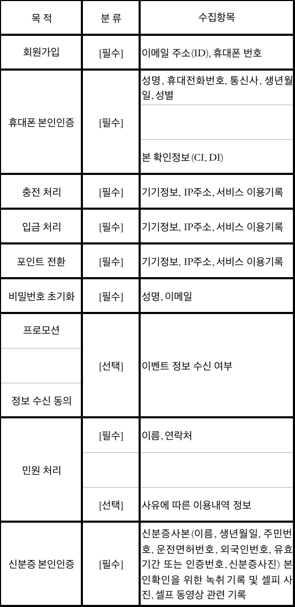
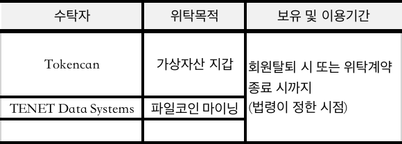
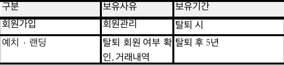
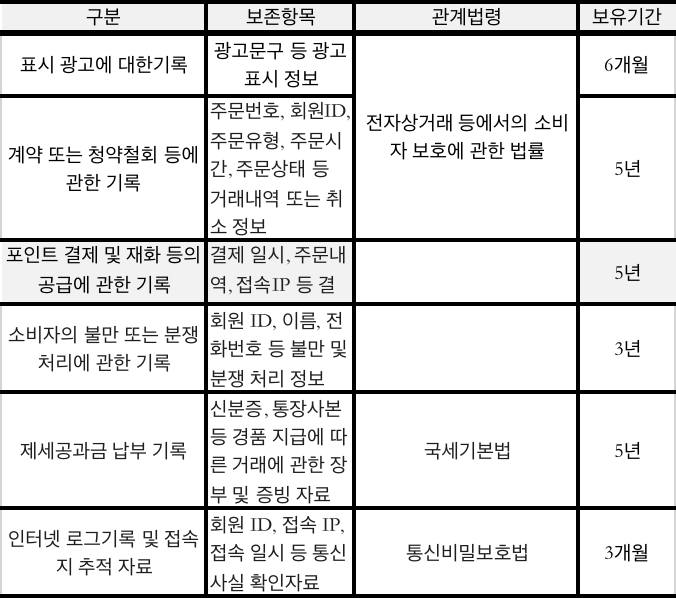

지더블유테크놀로지 개인정보 처리방침

주식회사 지더블유테크놀로지(이하 '회사')은 개인정보보호법에 따라 이용자의 개인정보 보호 및 ‘정보통신망 이용촉진 및 정보보호 등에 관한 법률’, ‘전자상거래 등에서의 소비자보호에 관한 법률’, ‘통신비밀보호법’, ‘전기통신사업법’, ‘개인정보보호법’ 등에 관한 법률 및 행정기관의 행정지침을 준수하고, 관련 법령에 의거한 개인정보처리방침을 정하여 이용자 권익을 보호하고 있습니다. “회사”의 개인정보처리방침은 개인정보보호와 관련한 법률 또는 지침의 변경, 당사 정책의 변화에 따라 변경될 수 있으므로, 회원께서는 당사 사이트 방문 시 수시로 확인하여 주시기 바랍니다. "회사"의 개인정보처리방침은 다음과 같은 내용을 담고 있습니다.

제1조 개인정보의 처리 목적

회사는 개인정보를 다음의 목적을 위해 처리합니다. 처리한 개인정보는 다음 목적 이외의 용도로는 사용되지 않으며, 이용 목적이 변경되는 경우에는 개인정보 보호법 제18조에 따라 별도의 동의를 받는 등 필요한 조치를 이행할 예정입니다.

1.회원가입 및 관리

> ①. 이용자 식별, 고객확인, 이용자 정보관리, 각종 고지사항 전달
>
> ②. 비 대면 본인 확인, 휴대폰 번호 및 사용자정보 변경

2.재화 또는 서비스제공
> ①. 디지털 자산 거래 관계 확인
> 
> ②. 디지털 자산 거래관계의 충천, 출금 등 서비스 관리 전반적인 사항 등

3.이벤트 정보 안내
> ①. 각종 이벤트 및 광고성 정보 제공
> 
> ②. 신규 서비스 및 맞춤형 서비스 제공

4.고충 및 민원 처리
> ①. 민원인의 신원 및 민원사항 확인
> 
> ②. 사실조사를 위한 연락, 통지, 처리결과 통보

제 2조 개인정보의 항목 및 수집 방법

1.개인정보의 수집항목

2.개인정보의 수집방법
> ①. 회원 가입 및 서비스 이용 항목별 이용자가 동의한 개인정보 수집
> 
> ②. 고객 문의, 이벤트, 제세공과금 등의 처리를 위해 채팅, 메일, 전화 등의 수단을 통해 수집
> 
> ③. 시스템을 통해 이용 기록에 대한 자동 수집

제 3조 개인정보 제3자 제공

1.회사는 정보 주체의 개인정보를 제1조(개인정보의 처리 목적)에서 명시한 범위 내에서만 처리하며, 정보 주체의 동의, 개인정보보호법 제17조, 18조 등에 해당하는 경우에만 개인정보를 제3자에게 제공합니다. 다만, 아래의 경우에는 예외적으로 제공될 수 있습니다.

>①. 서비스의 제공에 관한 계약의 이행을 위하여 필요한 개인정보로서 경제적, 기술적인 사유로
통상의 동의를 받는 것이 현저히 곤란한 경우
> 
>②. 서비스 제공에 따른 요금 정산을 위하여 필요한 경우
> 
>③. 다른 법률에 특별한 규정이 있는 경우

제4조 개인정보의 처리 위탁

회사는 원활하고 향상된 서비스를 위하여 개인정보를 제한된 범위에서 타 업체에게 위탁하여 관리할 수 있습니다. 현재 회원과의 서비스 계약 이행을 위해 당사가 개인정보처리를 위탁하는 업체는 아래와 같으며, 관계법령에 따라 위탁 계약 시 개인정보가 안전하게 관리될 수 있도록 필요한 사항을 규정하고 있습니다.

1.회사는 회사가 개인정보를 위탁업체에 제공하는 경우 위탁 받은 업체가 개인정보보호 관계 법령을 위반하지 않도록 관리 및 감독하고 있습니다.

2.회사는 이용자의 원활한 서비스 제공 및 편의 증진 등을 위하여 개인정보의 일부를 다음과 같이 국내에서 처리하도록 위탁하고 있습니다.

• 개인정보처리위탁 업체

“회사”는 위탁업무의 내용이나 수탁자가 추가 및 변경될 경우에는 지체없이 본 개인정보처리방침을 통하여 공개하고 이용자의 동의가 필요한 경우 이용자들의 동의를 받습니다.

제5조 개인정보의 보유 및 이용기간
회사는 관계법령에 따른 개인정보 보유 및 이용기간 또는 회원의 개인정보 수집 시에 동의 받은 개인정보 보유 및 이용기간에 따라 개인정보를 처리하고 있습니다.

1.개인정보의 처리 및 보유기간

>①. 회원 가입 및 관리: 탈퇴 시까지
> 
>②. 재화 또는 서비스 제공: 재화 또는 서비스 공급완료 및 결제·정산 완료 또는 관계 법령에 따른 보관 기간까지
> 
>③. 마케팅 및 광고 이벤트 활용: 이벤트 종료 후 180일내 파기
> 
>④. 소비자 불만 분쟁처리 기록: 3년 또는 관계 법령에 정해진 보관 기간까지

2.회사는 아래와 같이 필요한 경우에만 개인정보를 보유 및 이용합니다.

> ① 예치·랜딩 서비스를 위한 개인정보 보유 및 이용기간
> 
>> 
>
>② 재화 또는 서비스 제공에 따른 법령에 의한 보존
>
>> 
>>
>> ※ 단, 사고 조사, 분쟁해결, 민원처리, 법령상 의무이행을 위한 경우 분리하여 별도 보관

3. 회원의 동의를 받아 보유하고 있는 거래정보에 대해 회원께서는 열람을 요구하는 경우에는 지체없이 그 열람·확인할 수 있도록 조치합니다.

   제 6조 개인정보 파기 절차 및 방법

   회사는 수집한 개인정보의 이용목적이 달성된 후에는 보관기간 및 이용기간에 따라 해당 정보를 지체없이 파기 또는 별도 분리 보관합니다. 단, 회원께서 회원탈퇴 시 모든 개인정보는 자동 파기됩니다. 그 절차, 시점, 방법은 다음과 같습니다.

   1.정보 주체로부터 동의 받은 개인정보 보유기간이 경과하거나 처리목적이 달성되었음에도

   불구하고 다른 법령에 따라 개인정보를 계속 보존하여야 하는 경우에는 해당 개인정보를 별도의 데이터 베이스에(DB)로 옮기거나 보관장소를 달리하여 보존합니다.

>   ①. 휴면 회원
> 
> >   1)법령근거: 개인정보보호법 제39조의 6, 개인정보보호법 시행령 제48조의 5
> >
> >   2)분리 보관하는 개인정보 항목: 이름, 휴대폰번호, 본인 확인정보 (CI, DI)
> 
>   ②. 탈퇴 회원

1) 법령근거: 개인정보보호법 제21조의 개인정보 파기에 관한 법령

2) 분리 보관하는 개인정보 항목: 이름, 휴대폰번호, 본인 확인정보 (CI, DI)

   제 7조 이용자 및 법정 대리인의 권리와 그 행사방법

>   1.이용자 및 법정 대리인은 언제든지 등록되어 있는 자신의 개인정보에 대해 다음의 권리를 행사할 수 있습니다.
>
> >    ①. 개인정보 열람요구
> >
> >    ②. 개인정보 오류 등이 있을 경우 정정요구
> >
> >    ③. 개인정보 삭제 요구
> >
> >    ④. 개인정보 처리정지 요구

2.제1항에 따른 권리 행사는 회사에 대해 개인정보보호법 시행규칙 별지 제8호 서식에 따라서 서면, 전자우편 등을 통하여 할 수 있으며 회사는 이에 대해 지체없이 조치하겠습니다.

3.정보 주체가 개인정보의 오류 등에 대한 정정 또는 삭제를 요구한 경우에는 회사는 정정 또는 삭제를 완료할 때까지 당해 개인정보를 이용하거나 제공하지 않습니다.

4.제1항에 따른 권리 행사는 정보 주체의 법정대리인이나 위임을 받은 자 등 대리인을 통하여 할 수 있습니다. 이 경우 개인정보보호법 시행규칙 별지 제11호 서식에 따른 위임장을 제출해야 합니다.

제8조 개인정보의 안전성 확보 조치

회사는 개인정보보호법 제29조에 따라 다음과 같이 안정성 확보에 필요한 기술적/관리적 및 물리적 조치를 하고 있습니다.

1. 관리적 보호조치

>    ①. 내부관리계획의 수립 시행
>
>>    1). 개인정보보호책임자의 지정에 관한 사항
>>
>>    2). 개인정보보호책임자 및 개인정보취급자의 역할 및 책임에 관한 사항
>>
>>    3). 개인정보의 안전성 확보에 필요한 조치에 관한 사항
>>
>>    4). 개인정보취급자 및 위탁업체에 대한 교육에 관한 사항
>>
>>    5). 그 밖에 개인정보 보호를 위하여 필요한 사항
>
>    ②. 정기적인 자체 감사 실시
>>    1). 개인정보 보호책임자와 감사자의 직무분리 사항
>>
>>    2). 개인정보 감사자의 역할 및 책임에 관한 사항
>>
>>    3). 개인정보 취급 관련 안전성 확보를 위한 정기적 자체 감사

2. 기술적 보호조치

>   ①. 개인정보취급자의 회원정보의 유출을 방지하기 위하여, 개인정보 유출방지 시스템을 운영하고 있으며, 단말기(PC) 및 네트워크 상의 전송되는 개인정보는 안전한 암호 알고리즘을 적용하고 있습니다.
> 
>   ②. 개인정보처리시스템에 대한 접근권한을 업무 수행에 필요한 최소한의 범위로 하여, 업무 담당자 별로 한 개의 사용자 계정을 차등 부여하고 있으며, 개인정보취급자가 변경되었을 경우 개인정보시스템의 접근권한을 변경 또는 말소하고 그 기록을 최소 5년간 보관합니다. 또한, 개인정보취급자의 비밀번호 작성규칙을 수립하여 적용하고 있습니다.
> 
>   ③. 개인의 고유식별정보, 비밀번호를 정보통신망을 통하여 송•수신하거나 보조저장매체 등을 통하여 전달하는 경우에는 이를 상용 암호화 소프트웨어를 사용하여 저장하고 있으며, 비밀번호는 안전한 암호알고리즘으로 암호화하여 저장합니다.
> 
>   ④. 개인정보취급자가 개인정보처리시스템에 접속한 기록을 최소 2년 이상 보관•관리하며, 개인정보취급자의 접속기록이 위•변조 및 도난, 분실되지 않도록 해당 접속기록을 안전하게 보관하고 있습니다.
> 
>   ⑤. 개인정보처리시스템 또는 업무용 컴퓨터에 악성 프로그램 등을 방지•치료할 수 있는 백신 소프트웨어 등의 보안 프로그램을 설치•운영하고 있으며, 보안 프로그램의 자동 업데이트 기능을 사용하고, 주기적인 단말기(PC) 검사를 실시하고 있습니다.

3. 물리적 보호조치

>   ①. 전산실, 자료보관실 등 개인정보를 보관하고 있는 물리적 보관 장소에 대한 출입통제 절차를 수립 운영하고 있으며, 개인정보가 포함된 서류, 보조저장매체 등을 잠금 장치가 있는 안전한 장소에 보관 및 관리하고 있습니다.

제 9조 개인정보 자동수집 장치의 설치•운영 및 그 거부에 관한 사항

회사는 이용자의 서비스 편의를 제공하기 위해 이용정보를 저장하고 수시로 불러오는 ‘쿠키(cookie)’를 사용합니다. 쿠키는 웹사이트가 고객의 컴퓨터 브라우저(인터넷 익스플로러 등)에 전송하는 소량의 정보입니다.

1.쿠키의 사용 목적

>①. 쿠키를 통해 이용자가 선호하는 설정 등을 저장하여 이용자에게 더욱 빠른 웹 환경을 지원하며, 편리한 이용을 위해 서비스 개선에 활용합니다. 이를 통해 이용자는 더욱 손쉽게 서비스를 이용할 수 있게 됩니다.

2.쿠키의 설치, 운영 및 거부

>①. 이용자는 쿠키 설치에 대한 선택권을 가지고 있으며, 언제든지 이러한 쿠키의 저장을 거부하거나 삭제할 수 있습니다.

3.쿠키 설정 거부 방법
>①. 이용자는 쿠키 설치에 대한 선택권을 가지고 있으며, 언제든지 이러한 쿠키의 저장을 거부하거나 삭제할 수 있습니다.
> 
>> 1). Internet Explorer: 도구 메뉴 선택 > 인터넷 옵션 선택 > 개인정보 탭 클릭 > 고객 개인정보 설정 > 쿠키 수준 설정
> >
>> 2). Chrome: 설정 메뉴 선택 > 고급 설정 표시 선택 > 개인정보 및 보안 > 쿠키 및 기타 사이트 데이터 > 쿠키 수준 설정
> >
>> 3). Safari: 환경설정 메뉴 선택 > 개인정보 탭 선택 > 쿠키 및 웹사이트 데이터 수준 설정

제 10조 개인정보보호 책임자 및 담당자

회사는 회원의 개인정보보호를 매우 소중하게 생각하며, 회원의 개인정보가 훼손, 침해 또는 누설되지 않도록 최선을 다하고 있습니다. 그러나 기술적인 보완조치를 했음에도 불구하고, 해킹 등 기본적인 네트워크상의 위험성에 의해 발생하는 예기치 못한 사고로 인한 정보의 훼손 및 방문자가 작성한 게시물에 의한 각종 분쟁에 관해서는 책임이 없습니다. 나. 회원의 개인정보보호 관련 문의 시 회원센터에서 신속하고 성실하게 답변을 드리도록 하고 있습니다. 또한 회원이 “회사”의 개인정보 보호담당자와 연락을 원하실 경우 아래의 연락처 또는 이메일로 연락을 주시면 개인정보 관련 문의사항에 대하여 신속하고 성실하게 답변해 드리겠습니다.

| 개인정보 보호책임자 | 개인정보 보호담당자             |
|------------|------------------------|
| 성명 : 김장선   | 	성명 : 김나경              |
| 직위 : CEO   | 직위 : 매니저               |
| 연락처 : | 010-7658-3758          |
| 이메일 : | lichangshan1@naver.com |

제 11조 권익침해 구제방법
기타 개인정보 침해로 인해 구제를 받기 위한 상담이 필요한 경우에는 개인정보 분쟁조정위원회, 대검찰청, 경찰청, 한국인터넷진흥원 등으로 문의하실 수 있습니다.
>① 개인정보분쟁조정위원회
> 
>>웹사이트: www.kopico.go.kr
> >
>>전화: (국번 없이) 1833-6972
> 
>② 대검찰청 사이버범죄수사단
> 
>>웹사이트: http://www.spo.go.kr
> >
>>전화: (국번 없이) 1301
> 
>③경찰청 사이버안전국
> 
>>웹사이트: http://cyberbureau.police.go.kr
> >
>>전화: (국번 없이) 182
> 
>④ 개인정보 침해신고센터
> 
>>웹사이트: http://privacy.kisa.or.kr
> >
>>전화: (국번 없이) 118

제 12조 개인정보 열람청구

>-담당부서:
> 
>-전화번호:
> 
>-이메일:

제 13조 개인정보처리방침 변경

개인정보처리방침은 시행일로부터 적용되며, 법령 및 방침에 따른 변경내용의 추가, 삭제 및 정정이 있는 경우에는 이용자에게 충분하게 고지를 합니다.

부 칙

제 1조 (시행일) 개인정보처리방침은 2022년02월 17일부터 적용됩니다.  부칙(1:22.02.17)
