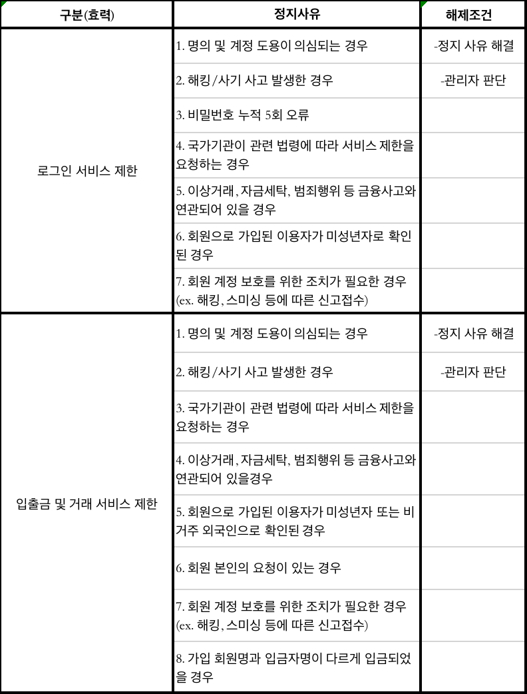

[//]: # (服务条款)

이용약관 (Ver. 220217)

개정: 2020.02.17

재정: 2020.02.01

제1조 (목적)

이 약관은 주식회사 지더블유테크놀로지(이하 "회사")가 제공하는 티보너스프로(TBouns Pro)관련 제반 서비스 (이하 "서비스")의 이용조건 및 절차에 관한 회사와 회원 간의 권리 의무 및 책임사항, 기타 필요한 사항을 규정함을 목적으로 합니다.

제2조 (약관의 명시, 효력과 개정)

1. 이 약관의 내용은 회사가 운영하는 서비스 초기 화면에 게시하거나 회원 가입시 또는 기타의 방법으로 사용자에게 공지하고, 이용자가 회원으로 가입하는 과정에서 이 약관에 동의하면 효력이 발생합니다.
2. 회사는 “약관의 규제에 관한 법률”, “정보통신망 이용 촉진 및 정보보호 등에 관한 법률” 등 관련 법령을 위배하지 않는 범위에서 이 약관을 개정할 수 있습니다.
3. 회사가 약관을 개정할 경우에는 1항의 방법으로 적용일자 및 개정 사유를 회사가 제공하는 서비스 초기 화면이나 팝업 화면 또는 공지사항에 명시하여 개정된 내용과 함께 시행일 30일 이전에 회원에게 고지합니다.
4. 회원이 개정된 약관의 적용 전일까지 변경된 약관의 적용에 동의하지 않는다는 명시적 의사를 표명한 경우 회사는 개정된 약관을 적용할 수 없으며, 이 경우 회원은 이용계약을 해지할 수 있습니다. 다만, 정보통신망법 등의 법률에 따라 기존 약관을 적용할 수 없는 경우 회사는 고객에게 공지 및 개별안내 후 30일간 이상의 유예기간을 두고 이용계약을 해지할 수 있습니다.
5. 회원의 관리 또는 의무에 영향을 미치는 중요한 내용이 변경되는 때에는 회원들이 그 내용을 충분히 알 수 있도록 공지를 하며 가입 정보에 따라 개별적으로 통지해야 합니다.

제3조 (약관 외 준칙)

1. 회사가 제공하는 서비스 또는 별도 서비스에 대하여 이 약관 외에 별도의 운영정책, 개별 약관, 개별 동의사항, 이용안내, 세부지침 등을 정하여 이를 회원에게 알리거나 동의를 받아 변경을 요구할 수 있습니다.

2. 이 약관에서 정하지 아니한 사항과 이 약관의 해석에 관하여는 1항에서 고지한 내용과 관련 법령 또는 상관례에 따릅니다.

제4조 (용어의 정의)

이 약관에서 사용하는 용어의 정의는 다음과 같습니다. 본 조에 의한 용어의 정의는 가상자산의 법적 구분 및 확립되지 않은 법률 해석을 보증하지 않고 동종 업계에서 통용되는 용어 및 이제 준하는 용어의 정의를 따릅니다.
1. 회원 : 이 약관을 승인하고 회원가입을 하여 회사와 서비스 이용계약을 체결한 자를 의미합니다.
2. 계정(ID) : 회원의 식별과 서비스 이용을 위하여 이메일 주소로 표시됩니다.
3. 비밀번호: 회원의 동일성 확인과 회원정보의 보호를 위하여 회원이 회사가 승인한 문자와 숫자의 조합대로 설정한 것을 의미합니다.
4. 포인트 : 포인트라 함은 티보너스프로(TBouns Pro)에 사용되는 재화로 변환과 환불을 통해 서비스 내에서 이용이 가능한 전자적 증표를 의미합니다.
5. 가상자산 : 비트코인(BTC), 이더리움(ETH), 파일코인(FIL) 등 경제적 가치를 지닌 것으로서 전자적으로 거래 또는 이전될 수 있는 전자적 증표를 의미합니다.
6. 전자지갑 : 회원의 아이디와 연계되어 회원이 보유하고 있는 가상자산을 보관하기 위해 사용하는 가상자산 지갑(Wallet)을 의미합니다. 회원은 전자지갑을 통해 외부 가상자산 주소로 가상자산을 이체할 수 있습니다.
7. 포인트지갑 : 회원의 아이디와 연계되어 회원이 보유하고 있는 포인트를 보관 및 사용하기 위한 계정의 자산을 의미합니다. 회원은 포인트지갑을 통해 원화(KRW) 충전 및 환전을 할 수 있습니다.

제5조 (계정 생성 및 거절)

1. 회원은 회사가 정한 가입신청 양식에서 요구하는 모든 사항을 정확히 기재하고 이용 신청을 한 경우 계정을 생성할 수 있습니다.
2. 계정(ID)은 본 약관에 동의해서 이메일 주소 또는 휴대전화 번호로 본인확인 서비스를 통해 본인인증 절차를 완료하면 회사가 가입을 승낙하는 절차로 생성됩니다.
3. 회사는 정보통신관련 법령에서 정한 정보통신사업자 의무 이행을 위하여 확인해야 할 회원 정보, 거래내역 등 수집, 생성, 이용, 보관, 제3자 정보를 제공할 수 있습니다. 회원이 서비스 가입 및 이용 과정에서 회사에게 고객정보 및 거래정보를 제공하지 않는 경우 회사는 회원의 서비스 가입 신청을 승낙하지 않거나 서비스 이용을 제한할 수 있습니다. 회사는 법령에서 정한 정보제공의 종류, 제공 절차와 방법 및 인증 단계에 따른 서비스 범위 등에 관한 세부 사항을 약관을 통하여 정하며, 이용의 안내는 이용가이드를 통해 제공합니다.

제6조 (계정 생성 거절 및 유보)

회사는 아래에 해당하는 사유가 발행하게 될 경우 회원의 계정 생성을 거절할 수 있고, 미성년자(만 19세 미만) 또는 단독으로 법률행위를 행사할 수 없는 제한능력자는 계정을 생성할 수 없습니다.

1. 이름이 실명이 아닌 경우
2. 회원이 다른 사람 명의의 개인정보를 도용하려 계정을 생성하려는 경우
3. 계정 생성시 필요한 정보를 입력하지 않거나 허위의 정보를 입력하는 경우
4. 미성년자 또는 제한 능력자가 법정 대리인의 동의 없이 회원에 가입한 것으로 확인되는 경우
5. 회원의 개인정보가 유출되었거나 유출된 것으로 판단되는 경우
6. 대한민국 정부 및 산하기관에서 정책 신설, 변경, 폐지 등으로 인하여 회사가 신규 계정을 생성할 수 없는 경우
7. 회원의 거주 국가에서 효력이 발생하는 법률에 따라 본 서비스 이용행위가 해당 법률(보이스피싱과 관련된 금융범죄사고 등)을 법률 위반 행위로 수사기관에 접수가 된 경우
8. 회원이 과거 서비스를 이용하는 과정에서 본 약관을 위반하여 서비스 이용계약이 해지된 경우
9. 회사에서 진행하는 이벤트 프로모션에 불법적인 행위를 진행하기 위한 수단으로 유사계정 생성을 신청하는 경우
10. 회원이 어떤 목적을 가지고 서비스 운영을 고의로 방해하거나 상업적으로 이용하는 경우
11. 자금 세탁, 테러 자금 조달 위험이 높은 국가의 국정을 가지거나 해당 국가에 거주하는 경우
12. 회사의 서비스 개선 또는 서비스 제공을 위한 기술적인 문제가 있다고 판단되는 경우
13. 가상자산 시세에 부당한 영향을 주는 등의 방법으로 건전한 거래질서를 교란하는 행위를 한 경우
14. 기타 회사가 기술적, 재정적으로 유보가 필요한 경우

제7조 (계정 관리)

1. 계정은 회원 본인만 이용해야 하고 어떠한 경우라도 다른 사람에게 회원 계정을 대여하거나 무단으로 이용하는 것을 원칙적으로 금지합니다.
2. 회원은 다른 사람이 회원의 계정을 무단으로 사용하거나 도용할 수 없도록 직접 비밀번호를 관리하여야 합니다. 만일 회원의 계정을 무단으로 사용하는 행위를 발견하는 즉시 고객센터를 통해 회사에 이를 통보해야 하고 회사는 즉시 계정 이용 중지 등의 조치를 취할 수 있습니다.
3. 회사가 서비스 내 등록된 회원 정보를 통해 이메일, 전화번호 등으로 이용계약에 대한 중요한 내용을 통지했음에도 불구하고, 회원이 변경된 약관에 대한 정보를 알지 못하여 발생하는 불이익은 회원이 부담하여야 합니다.
4. 회사는 국내 법령 준수 및 회원 입출금 계좌의 안전한 관리를 위해회원 1인 1계좌 1계정 정책을 시행하고 있습니다. 회원은 본인 명의의 계정을 사용하여야 하고, 회사와 별도의 합의 없이 2개 이상의 계정을 사용할 수 없습니다.

제8조(서비스의 종류)

1. 회사에서 제공하는 서비스에는 가상자산과 포인트 예치 입금, 출금, 보관, 컨텐츠 서비스 등이 있습니다.
2. 회사는 서비스의 종류에 따라 각 서비스의 특성, 절차 및 방법에 대한 사항을 서비스 화면을 통하여 공지하며, 회원은 회사가 공지한 각 서비스에 관한 사항을 이해하고 서비스를 이용해야 합니다.
3. 서비스의 종류는 이용자 포인트와 운영상에 문제가 있다고 판단될 경우에 일부 변경될 수 있습니다.

제9조(서비스의 내용)
1. 회사는 별도의 서비스를 제공할 수 있고 이에 관한 사항은 공지사항을 통하여 공지합니다.
2. 회사는 365일, 24시간 서비스를 제공하기 위해 최선의 노력을 다합니다. 다만, 장비의 유지·보수를 위한 정기 또는 임시 점검 등 다른 상당한 이유로 회사 서비스의 제공이 일시 중단될 수 있으며, 이 경우 회사는 사전에 서비스 초기 화면이나 공지사항 등을 통해 회원에게 통지합니다.
3. 긴급한 시스템 점검, 증설 및 교체, 서비스 이용의 폭주, 국가비상사태, 정전 등 부득이한 사유가 발생한 경우 사전 예고 없이 일시적으로 서비스의 전부 또는 일부를 중단할 수 있으며, 이 경우 사후에 통지할 수 있습니다.

제10조(이용계약의 성립)
1. 이용자는 회사가 정한 가입 양식에 따라 회원정보를 기입한 후 이 약관에 동의한다는 의사표시를 함으로써 회원가입을 신청합니다.
2. 회원가입은 회사의 승낙이 회원에게 도달한 시점으로 합니다.
3. 이용 계약은 회원 ID 단위로 체결합니다. 이용계약이 성립되면, 이용 신청자는 회원으로 등록됩니다.

제11조(회원의 의무)
1. 회원은 관계 법령, 이 약관, 이용안내 및 서비스와 관련하여 회사가 공지하거나 통지한 사항 등을 준수하여야 하며, 기타 회사의 업무에 방해되는 행위를 하여서는 안됩니다.
2. 회원은 전기통신금융사기(보이스피싱)로 인하여 피해가 발생하지 않도록 주의를 기울여야합니다. 만일 전기통신금융사기로 인하여 수사기관, 사법부, 행정청 기타 공권력의 조사가 이루어져 해당 계정 및 전자지갑 등의 동결이 필요할 경우, 회사는 회원의 동의 없이 해당 계정 및 전자지갑 등을 동결함과 동시에 계정 정지에 따른 절차에 착수할 수 있습니다.
3. 회원은 가상자산을 각 가상자산의 특성에 따라 송금하여야 합니다. 회원의 책임이 있는 사유로 오-송금이 발생한 경우, 회사는 문제 해결을 위하여 노력하고, 비용이 발생시에는 회원이 부담합니다.

제12조 (서비스의 유지 및 중지)
1. 서비스의 이용은 회사의 업무상 또는 기술상 특별한 지장이 없는 한 연중무휴 1일 24시간을 원칙으로 합니다. 다만 회사는 거래 시스템의 정합성을 유지할 수 있도록 노력하지만 정기 점검, 임시 점검 등을 필요로 하는 날이나 시간은 그러하지 않습니다.
2. 회사는 다음 각 호의 하나에 해당하는 경우 서비스 제공을 중지할 수 있습니다.

   (1). 서비스용 설비의 보수 등 공사로 인한 부득이한 경우

   (2). 전기통신사업법에 규정된 기간통신사업자가 전기통신 서비스를 중지했을 경우

   (3). 회사가 직접 제공하는 서비스가 아닌 제휴업체 등의 제삼자를 이용하여 제공하는 서비스의 경우 제휴업체 등의 제삼자가 서비스를 중지했을 경우

   (4). 기타 법률로 인한 불가항력적 사유가 있는 경우

3. 회사는 국가비상사태, 정전, 서비스 설비의 장애 또는 서비스 이용의 폭주 등으로 정상적인 서비스 이용에 지장이 있는 때에는 서비스의 전부 또는 일부를 제한하거나 정지할 수 있습니다.
4. 회사는 주문량의 폭주로 인하여 전산 장애가 발생하는 등의 사유로 회원에게 손해가 발생할 수 있는 염려가 있을 때에는 필요로 하는 최소한의 범위에서 긴급점검을 진행함으로써 거래 시스템상의 오류 발생으로 인하여 회원에게 발생할 수 있는 손해를 예방하는 조치를 진행할 수 있습니다. 이 때 회사는 점검의 사유 및 점검 진행 경과를 홈페이지접속 시 초기 화면 또는 공식 채널을 통해 공지합니다.

제13조(서비스 이용제한 및 해제)
1. 회사는 아래 사항에 해당하는 경우 서비스 제한, 로그인 제한, 입출금 및 거래 서비스를 제한하거나 지연하여 승인할 수 있습니다.
2. 본 조에 해당하는 경우 회사는 해당 내용을 회원에게 이메일, SMS 메시지, 홈페이지 공지 등의 방법을 통해 알립니다.
3. 이용 제한 및 지연 등의 사유가 중복 발생 시에는 관리자가 요구하는 해제조건을 갖추었을 경우에 한해 해제 처리할 수 있습니다.
4. 복수의 이용 제한 사유가 있는 경우 회사는 모든 이용 제한 사유가 해소된 경우에 한해 이용 제한을 해제 처리할 수 있습니다.
5. 계정에 대한 자체 조사 종료 후 회사는 보이스피싱 및 범죄에 대한 구체적인 사유가 있는 지갑 보유 계정에 따라 30일 이상의 사전 통지 후 회원 계정 사용을 제한할 수 있고, 회사는 결정된 내용에 대하여 회원에게 개별 통보하며, 회원은 이에 대한 소명 절차를 진행할 수 있습니다.
6. 계정 정지 시 회사는 계정에 대한 자체 조사를 실시하며, 회원은 회사의 조사에 적극적으로 협력해야 합니다.

제14조(이용계약의 중지 및 해지)
1. 회원이 이용계약을 해지하고자 할 경우, 회원 본인 혹은 법인회원의 담당자가 회사에 해지 신청을 하여야 하며, 계정 내 각 가상자산을 모두 출금할 후 해지 신청하는 것을 원칙으로 합니다.
2. 회사는 회원이 제16조 각 항의 어느 하나에 위반하여 계정을 생성한 것으로 판명되면, 회사는 시정요구와 동시에 30일의 소명 기회를 부여하며, 시정 요구에도 불구하고 사유가 해소되지 않는 경우 회원의 서비스 이용 중단, 이용 계약 해지 등 필요한 제한 조치를 실행할 수 있습니다. 단, 서비스 이용에 관련된 범죄사실에 연루되어 있으면 즉시 제한 조치를 실행할 수 있습니다.
3. 서비스 이용중지를 받은 회원 또는 그 대리인은 이용중지에 대하여 이의가 있을 경우 이의 신청을 할 수 있습니다.
4. 회사가 긴급하게 이용을 중지해야 할 필요가 있다고 인정하는 경우(불법자금, 보이스피싱 등과 같이 범죄사실이 포함되어 있는 경우)에는 제3항의 과정 없이 서비스 이용을 제한할 수 있습니다.
5. 회사는 이용중지 기간 중에 그 이용중지 사유가 해소된 것이 확인된 경우에 한하여 이용중지 조치를 즉시 해제합니다.
6. 이용계약 해지

   (1). 회사는 제2항의 범죄 사실로 인해 서비스 이용을 중지 또는 제한시킨 후 동일한 행위가 2회 이상 반복되거나 30일 이내 시정되지 않는 경우에는 이용계약을 해지할 수 있습니다.

   (2). 회사가 이용계약을 해지하는 경우에는 개인정보보호정책에 따라 회원 등록을 말소합니다. 이 경우 회원에게 이용계약 해지 예정임을 통지하고 30일의 소명 기회를 부여한 다음 관련 법령에 따라 이용계약을 해지할 수 있습니다. 이용중지 사유가 해소된 것이 확인된 경우에는 이용중지 조치를 즉시 해제합니다.

제15조(회원정보 사용 및 정보 제공에 대한 동의)
1. 회사는 회원의 개인 정보를 본 이용계약의 이행과 본 이용계약상의 서비스 제공을 위한 목적으로 이용합니다.
2. 회원이 회사 및 회사와 제휴한 서비스들을 편리하게 이용할 수 있도록 하기 위해 회원 정보는 회사와 제휴한 업체에 제공될 수 있습니다. 단, 회사는 회원 정보 제공 이전에 제휴 업체, 제공 목적, 제공할 회원 정보의 내용 등을 사전에 동의를 받아야 하며, 정보제공을 동의한 회원에 한하여 정보를 제공해야합니다.
3. 회사는 회원의 명시적인 수신거부 의사에 반하여 제휴한 서비스의 광고성 정보를 전송하지 않습니다. 단, 회사는 회원이 서비스 이용 중 필요가 있다고 인정되는 다음 각 호의 하나와 같은 서비스 정보에 대해서 이메일, 문자서비스(SMS) 등의 방법으로 정보제공의 사전동의를 받은 회원에게 제공할 수 있으며 회원은 원치 않을 경우 프로모션 정보수신동의 거부 또는 회원가입 탈퇴를 통해 정보 수신거부를 할 수 있습니다.

   (1). 가상자산 거래 관련 서비스

   (2). 이벤트, 프로모션, 행사 관련 등의 서비스

   (3). 기타 회사가 수시로 결정하여 회원에게 제공하는 서비스

4. 회원정보의 관리 책임자는 회사가 정하는 운영자입니다.
5. 회사는 전기통신 기본법 등 법률의 규정에 의해 국가기관의 요구가 있는 경우, 범죄에 대한 수사상의 목적이 있거나 정보통신윤리위원회의 요청이 있는 경우 또는 기타 관계법령에서 정한 절차에 따른 요청이 있는 경우를 제외하고는 언제나 제휴 업체, 제공 목적, 제공할 회원 정보 내용 등을 사전에 공지하고 회원의 동의를 얻은 경우에 한하여 회원의 정보를 제3자에게 제공할 수 있습니다.
6. 회원은 회원가입 신청 시 기재한 주요 정보가 변경되었을 경우 신용 관리상 합당한 사유가 인정되면, 고객센터 또는 홈페이지를 통하여 수정이 가능합니다.
7. 회원의 이용 계약 해지는 제9조에 따르며, 이용계약이 해지된 경우 회원의 신상정보는 전자상거래 등에서의 소비자보호에 관한 법률 등 관계법령에서 명시한 자료를 보관하며 이후에는 삭제합니다.
8. 회사는 개인 정보를 파기하여야 할 의무가 있는 경우라도 상법 등 관계법령의 규정에 의하여 보존할 필요가 있는 경우에는 관계법령에서 정한 기간 동안 회원의 개인 정보를 보관합니다.
9. 특정 서비스 사용을 위해 개인 정보를 수집하거나 전송할 필요가 있을 경우, 회사는 반드시 회원에게 이와 같은 사실을 사전 공지하고 회원의 동의를 구해야 합니다.
10. 회원이 제공한 개인 정보는 회원의 동의 없이 목적 외의 이용으로 제공할 수 없습니다. 단, 다음 각호의 경우는 예외로 합니다.

    (1). 가상자산 대금 결제와 수수료 청구를 위해 납부 대행사에 개인 정보를 제공하는 경우

    (2). 법률적 증거자료로서 수사기관 등에 제공하는 경우(법적인 절차에 따라 제공할 수 있습니다.)

    (3). 관계법령에서 명시하는 경우

제16조(손해배상 및 면책조항)
1. 회사 또는 회원은 본 약관을 위반하여 상대방에게 손해를 입힌 경우에는 그 손해를 배상할 책임이 있습니다. 다만, 행위자의 고의 또는 과실이 없는 경우에는 그러하지 아니합니다.
2. 회사는 다음 각 호의 경우로 서비스를 제공하지 못하여 회원에게 발생한 손해에 대해서는 책임을 면합니다.

   ①. 천재지변 또는 이에 준하는 불가항력의 상태가 있는 경우

   ②. 정부 기관의 사실상 또는 법률상 행정처분 및 명령 등 이에 준하는 법적 조치로 인한 경우

   ③. 서비스의 효율적인 제공을 위한 시스템 개선, 장비 증설 등 계획된 서비스 중지 일정을 사전에 공지한 경우

   ④. 회원의 귀책사유로 서비스 이용에 장애가 있는 경우

   ⑤. 기타 회사의 고의과실이 없는 사유로 인한 경우

   ⑥. 회사는 회원이 서비스를 통해 얻은 정보 등으로 인해 발생한 손해와 서비스를 이용하거나 이용할 것으로부터 발생하거나 기대하는 손익 등에 대하여 책임을 면합니다.

   ⑦. 회사는 무료로 제공하는 서비스 이용과 관련하여 관련법에 특별한 규정이 없는 한 책임을 면합니다.

제17조(관할법원 및 준거법)
1. 서비스에 이용 약관은 대한민국 법률에 따라 규율 되고 해석되며, 회사의 요금체계 등 서비스 이용과 관련하여 회사와 회원 간에 발생한 분쟁으로 소송이 제기되는 경우 대한민국 법률이 적용됩니다.
2. 서비스 이용과 관련하여 회사와 회원 간에 발생한 소송의 경우 대한민국 법령에 정한 절차에 따른 법원을 관할 법원으로 합니다.

부칙
제 1조 (시행일) 이 약관은 2022년 02월 17일부터 적용됩니다.  부칙(01:22.02.07)

